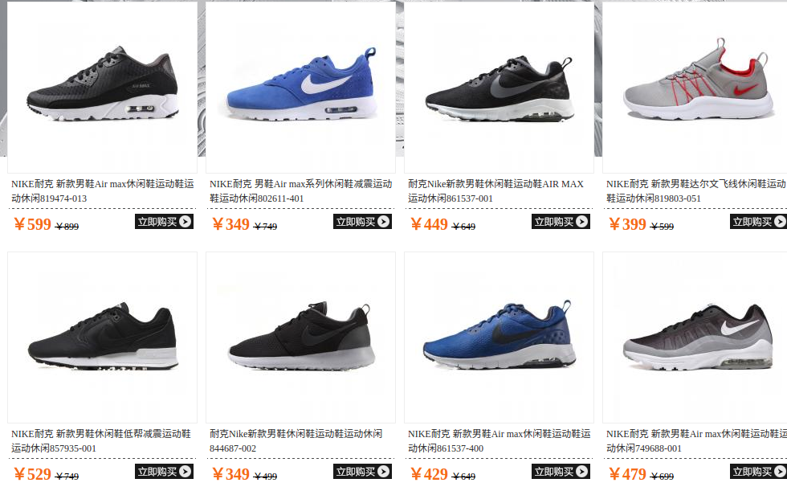
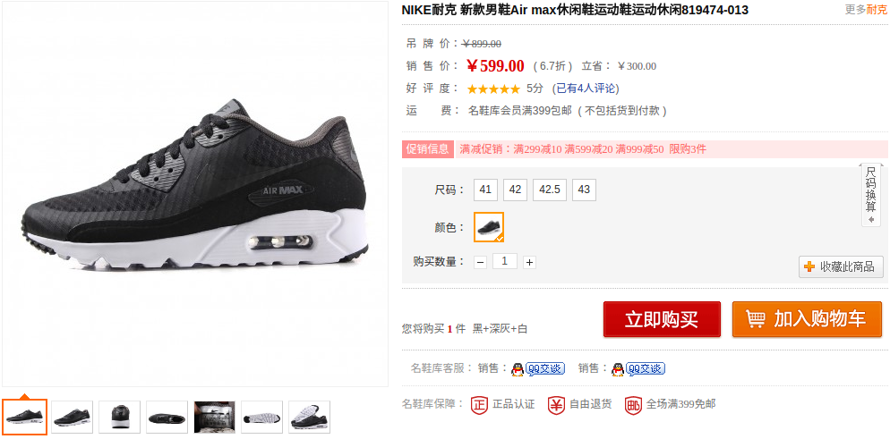

#### 【题目描述】

爬取 [名鞋库]('http://www.s.cn/') 网站下各品牌旗下的商品价格及商品描述。

要求如下：

1、从首页终提取所有品牌链接:


2、从各品牌的链接中获取商品详细页面的链接



3、进入商品的详细页面，获取商品价格以及商品描述



4、讲所有结果保存为 csv 文件

#### 【解题思路】

##### 创建项目

过程参考课程内容


##### 提取所有品牌链接

根据页面分析，发现所有品牌的链接在一个 div 中，其中 `class="brand_yd"`,然后将 url 中含有 "brand" 字符的链接提取到 `self.list_page` 函数处理。

```python

def index_page(self, response):
    pq_div = response.doc('.brand_yd')
    for each in pq_div('a[href^="http"]').items():
        if 'brand' in each.attr.href:
            self.crawl(each.attr.href, callback=self.list_page)

```

##### 获取商品详细页面链接

定义一个 `self.list_page` 函数处理，其作用为提取所有商品详细页面，提取到详细页面之后发送给 `self.detail_page` 函数进一步处理。
以下是一个比较粗糙的过滤方法。

```python

def list_page(self,response):
    for each in response.doc('a[href^="http"]').items():
        if 'list' in each.attr.href:
            continue
        self.crawl(each.attr.href, callback=self.detail_page)


```

##### 商品价格以及商品描述

根据页面上的 css 选择器，得到最后的爬取结果，添加简单的错误处理手段。

```python

def detail_page(self, response):
      try:     
          return {
              "url": response.url,
              "title": response.doc('.goodsname').text(),
              'price':response.doc('.salePrice_big').text(),

          }
      except:
          return None

```

##### 运行

返回 pyspider 主页，修改项目状态为 debug ，点击 run 即可。
