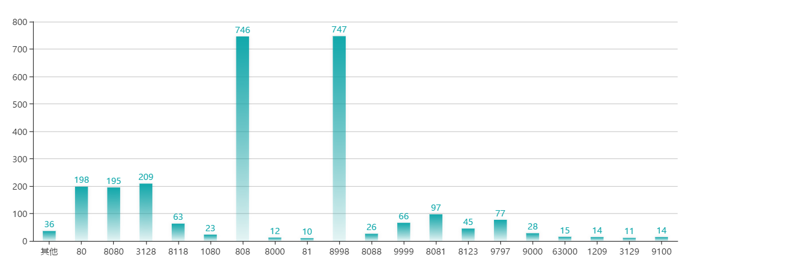

#### 【题目描述】

使用 scrapy 框架爬取 [66代理网]('http://www.66ip.cn/') 所有地区 IP，保存其 地址、端口、地区、代理类型 等信息到 mongodb 中，如下图所示：

|地址|端口|地区|类型|
|----|---|----|----|
|12.23.34.45|80|上海|高匿|

然后在存储的数据中提取出端口信息，结合 echarts 做出端口分布图，如下：


#### 【解决思路】

##### 生成项目

开启项目:

`scrapy startproject`

添加 Spider

`scrapy genspider sixsix www.66ip.cn`


##### 分析网页

经过分析，我们发现通过首页响应内容可以获取地区分页地址，在 parse 函数中添加代码，得到所有分页地址:


```python

def parse(self, response):
      # 取出各地分页面链接地址,采用 xpath 路径获取
      addr_urls_ul = response.xpath('//ul[@class="textlarge22"]')[0]
      addr_urls = addr_urls_ul.xpath('./li[not(@class)]/a/@href')
      for addr in addr_urls:
          url = addr.extract()
          yield Request(url='http://www.66ip.cn'+url,callback=self.get_details,dont_filter=True)

```
Request 中的 `self.get_details` 函数为处理分页信息的函数。

```python

def get_details(self,response):
      '''
      这里仅为数据提取部分，实际代码还须包括存入数据库部分

      '''
      soup = bs4.BeautifulSoup(response.body,'lxml')
      soup_table = soup.find('table',attrs={'bordercolor':True})
      soup_tr = soup_table.find_all('tr')

      for tr in soup_tr:

          data = tr.find_all('td')
          proxy = data[0].string        # 188.38.13.204
          port = data[1].string         # 8080
          location = data[2].string     # 北京市
          proxy_type = data[3].string   # 高匿代理

          # 之后还需将取出的数据通过管道存入数据库


```

##### 配置项目

`items.py`
添加下载信息的字段

```python
class SixsixItem(scrapy.Item):

    proxy = scrapy.Field()    # 188.38.13.204
    port = scrapy.Field()     # 8080
    location = scrapy.Field()     # 北京市
    proxy_type = scrapy.Field()    # 高匿代理

```

`settings.py`

配置下载延迟为 1 秒:

`DOWNLOAD_DELAY = 1`

配置 headers ，可从浏览器中获得

`DEFAULT_REQUEST_HEADERS = {...}`

mongodb 链接设置

```python

ITEM_PIPELINES = {
   'sixsix.pipelines.SixsixPipeline': 300,
}

MONGODB_SERVER = "localhost"
MONGODB_PORT = 27017
MONGODB_DB = "sixsix"
MONGODB_COLLECTION = "proxies"

```

`pipelines.py`

在管道文件下配置相应的 mongodb 设置

```python
class SixsixPipeline(object):

    def __init__(self):
        connection = pymongo.MongoClient(
            settings['MONGODB_SERVER'],
            settings['MONGODB_PORT']
        )
        db = connection[settings['MONGODB_DB']]
        self.collection = db[settings['MONGODB_COLLECTION']]

    def process_item(self, item, spider):

        # 写入数据
        self.collection.insert(dict(item))

        return item

```
